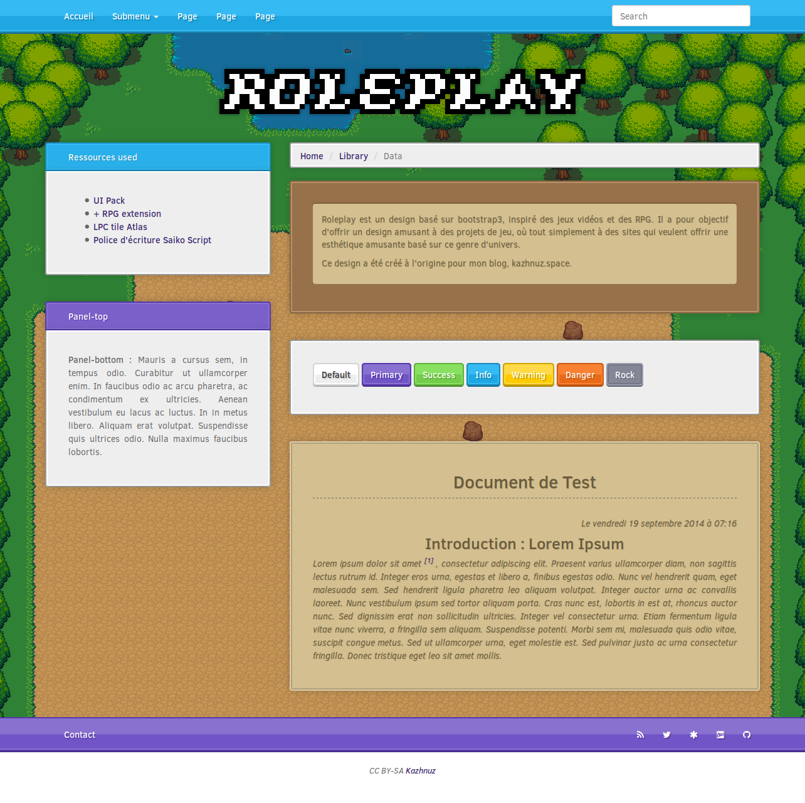

# ROLEPLAY

Roleplay est un design basé sur bootstrap3, inspiré des jeux vidéos et des RPG. Il a pour objectif d'offrir un design amusant à des projets de jeu, où tout simplement à des sites qui veulent offrir une esthétique amusante basé sur ce genre d'univers.

Ce design a été créé à l'origine pour mon blog, kazhnuz.space.

## Credits

- [UI Pack](http://opengameart.org/content/ui-pack) par Kenney

- [UI Pack RPG Extension](http://opengameart.org/content/ui-pack-rpg-extension) par Kenney

- [LPC Tile Atlas](http://opengameart.org/content/lpc-tile-atlas) par les contributeurs du projet Liberated Pixel Cup

- [Police d'écriture Saiko Script](https://opengameart.org/content/the-collection-of-8-bit-fonts-for-grafx2-r2) par usr_share

## Screenshot

